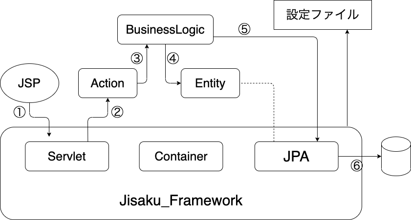

# Jisaku_Framework

## 実行環境

* Tomcat8.0
* Java8

## UsersGuide

1. Eclipseへの導入🤗

    以下を実行

    ```sh
    #workspace(tomcat入れてるworkspace)ディレクトリ直下でclone
    git clone https://github.com/Yumapon/Jisaku_Framework.git <プロジェクトにつけたい名前(Option)>

    ```

    Eclipseで開いて、エラー吐いていなければOK(サーバが指定されていないとエラー出ちゃうかも。。)
    なんかエラー出たら別途相談してください。

2. githubリポジトリの準備（任意）😋

    * github cli使用ver

    ```sh
    # github cliのインストール
    brew install gh

    # login(コンソールの指示に従ってgithubにログイン)
    gh auth login

    #cloneしてきたディレクトリ直下で実行
    # repositoryの作成(質問にはPublic → Y を選択)
    gh repo create <github repository に付けたい名前>

    #remote先を変更
    git remote remove origin
    git remote add origin ＜格納したいリポジトリのhttpsリンク＞

    ```

    * website ver

    ```sh
    #Github webサイトでリポジトリを作成

    #cloneしてきたディレクトリ直下で実行
    #今のremote先を確認(cloneしてきた先になってる)
    git remote -v

    #remote先を変更
    git remote remove origin
    git remote add origin ＜格納したいリポジトリのhttpsリンク＞
    ```

3. Frameworkの処理の流れ

    * Requestの処理の流れを超概要で説明すると以下の通り

        

        ※あくまでも処理の一例です。
        ①JSPから、Frameworkのservletにリクエストを送信
        ②servletがActionを呼び出す
        ③ActionがBusinessLogicを呼び出し、処理を行う
        ④BusinessLogicがEntityを作成
        ⑤BusinessLogicから、JPAを呼び出してDBへデータを格納orデータ取得

4. Frameworkの設定ファイルについて(DB設定、Bean設定、Action設定、BusinessLogic設定)😉

    設定ファイルは以下４つあり、記入していく必要があります。(設定ファイルの場所は固定です。不便ですが)

    | 名称 | 役割 | 場所 |
    |------|-----------|------------|
    | DBProfile.yaml | DBとの接続情報を定義する | src/jisaku_jpa/dbConfigReader/DBProfile.yaml |
    | ActionDefinitionConfig.yaml | ActionClassの定義をする | src/jisaku_dicontainer/container/ActionDefinitonConfig.yaml |
    | BeanDefinitionConfig.yaml | Beanクラスの定義をする | src/jisaku_dicontainer/container/BeanDefinitionConfig.yaml |
    | BusinessLogicDefinition.yaml | BusinessLogicクラスの定義をする | src/jisaku_dicontainer/container/BusinessLogicDefinition.yaml |

    <details><summary>DBProfile🚙</summary><div>

    * 記入例

        ```yaml
        DBの設定(記入例)
        !!jisaku_jpa.dbConfigReader.DBConfig #DB定義設定クラスのパス(基本変更しないでください)
        driver: com.mysql.cj.jdbc.Driver #driver名（左記はMySQLの例。自分の使用したいDBのDriver名を指定してください）
        url: jdbc:mysql://@localhost:3306/taskappdatabase #DBのURL（左記はMySQLの例。自分の使用したいDBのURL()を指定してください）
        user: root #DBのユーザ
        password: password #DBのパスワード
        numberOfAccess: 5 #コネクションの数（基本変更なし、アプリケーション実行時にコネクション数が不足している場合は、適宜変更してください。）
        dbName: taskappdatabase #DB名
        dbType: MySQL #DBの種類（今回対応するのはOracleLとMySQLのみ。大文字小文字は区別しません。）
        schema: #schema名(特段記載なしでもOK)
        ```

    * 確認方法

        以下のtestProgramを一部書き換えて実行すれば、接続できるかわかります。
        ※DBConfigクラスのコンストラクタ引数を書き換えてください。（詳細はソースコードに記載しています。）
        (javaクラスを右クリック→実行→Junitテスト)
        `test/jisaku_jpa/dbConnection/DBAccessTest.java`

    </div></details>

    <details><summary>ActionDefinitionConfig🚘</summary><div>

    * 記入例

        ```yaml
        #Actionクラスの定義（記入例）
        ---
        !!jisaku_dicontainer.container.definition_entity.ActionDefinition #Action定義設定クラスのパス(基本変更しないでください)
        name: actiona #Actionクラスの呼び出し名（定義している変数名を指定）例）<BusinessLogicの型> teststr; ならteststrを指定
        type: usercreatesample.actions.Action #Actionクラスのパス (src以下のパスを指定)
        ---
        !!jisaku_dicontainer.container.definition_entity.ActionDefinition #Action定義設定クラスのパス(基本変更しないでください)
        name: actionb #Actionクラスの呼び出し名（定義している変数名を指定）例）String teststr; ならteststrを指定
        type: usercreatesample.actions.ActionB #Actionクラスのパス (src以下のパスを指定)
        ```

    * 確認方法

        こいつは以下ファイルを少し作り込んでテストしてあげる必要があります。(別途相談してください。)
        `test/jisaku_dicontainer/container/ApplicationContainerImplTest.java`

    </div></details>

    <details><summary>BeanDefinitionConfig🚌</summary><div>

    * 記入例

        ```yaml
        #Beanクラスの定義（記入例）
        ---
        !!jisaku_dicontainer.container.definition_entity.BeanDefinition #Bean定義設定クラスのパス(基本変更しないでください)
        name: createTask #Beanクラスの呼び出し名（定義している変数名を指定）例）String teststr; ならteststrを指定
        type: usercreatesample.beans.CreateTaskEntity #Beanクラスのパス(src以下のパスを指定)
        ---
        !!jisaku_dicontainer.container.definition_entity.BeanDefinition #Bean定義設定クラスのパス(基本変更しないでください)
        name: deleteTask #Beanクラスの呼び出し名（定義している変数名を指定）例）String teststr; ならteststrを指定
        type: usercreatesample.beans.CreateTaskEntity #Beanクラスのパス(src以下のパスを指定)
        ```

    * 確認方法

        こいつは以下ファイルを少し作り込んでテストしてあげる必要があります。(別途相談してください。)
        `test/jisaku_dicontainer/container/ApplicationContainerImplTest.java`

    </div></details>

    <details><summary>BusinessLogicDefinitionConfig🚛</summary><div>

    * 記入例

        ```yaml
        #BusinessLogicクラスの定義（記入例）
        ---
        !!jisaku_dicontainer.container.definition_entity.BusinessLogicDefinition #Bean定義設定クラスのパス(基本変更しないでください)
        interfaceClass: usercreatesample.businessLogic.BusinessLogic #BLクラスのインターフェースのパス
        name: bl1 #BLクラスの呼び出し名 （定義している変数名を指定）例）String teststr; ならteststrを指定
        type: usercreatesample.businessLogic.DefaultBusinessLogic1 #BL実装クラスのパス (src以下のパスを指定)
        ---
        !!jisaku_dicontainer.container.definition_entity.BusinessLogicDefinition #Bean定義設定クラスのパス(基本変更しないでください)
        interfaceClass: usercreatesample.businessLogic.BusinessLogic #BLクラスのインターフェースのパス
        name: bl2 #BLクラスの呼び出し名 （定義している変数名を指定）例）String teststr; ならteststrを指定
        type: usercreatesample.businessLogic.DefaultBusinessLogic2 #BL実装クラスのパス (src以下のパスを指定)
        ```

    * 確認方法

        こいつは以下ファイルを少し作り込んでテストしてあげる必要があります。(別途相談してください。)
        `test/jisaku_dicontainer/container/ApplicationContainerImplTest.java`

    </div></details>

5. JSPからServletを呼び出す際の書き方。

    * jspに記載する内容

        1. \<form action="HogeHogeServlet" method="POST"> ※これは固定です。
        2. \<input type="hidden" name="formName" value=<requestパラメータを格納するEntityクラス名(BeanDefinitionConfig.yamlのnameに記載した名前)>>
        3. \<input type="hidden" name="actionName" value=<呼び出したいActionクラス名(ActionDefinitionConfig.yamlのnameに記載した名前)>>
        4. \<input type="hidden" name="actionMethodName" value=<呼び出したいActionクラスの中のメソッドに付与した@ActionMethod()に設定した名前>>
        ※ 4の@Actionmethod()については、次項6.Actionクラスの書き方を参照してください

        <details><summary> 記入例 </summary><div>

      * SampleCode

        上記設定必要な項目を以下の様に記載します（綺麗な形でAPI化できていないのでこんな書き方になっています。。）

        ```jsp
            <form action="HogeHogeServlet" method="POST">
                ・・・
                ・・・
                <input type="hidden" name="formName" value="userInfo">
                <input type="hidden" name="actionName" value="loginAction">
                <input type="hidden" name="actionMethodName" value="login">
            </form>
        ```

        </div></details>

6. Actionクラスの書き方

    * 使えるannotation

        1. @ActionMethod (jisaku_dicontainerのアノテーション)

            * 概要

                Actionクラス内のメソッドに付与するアノテーション。
                `@ActionMethod("create")`をメソッドに付与すると、jspに`<input type="hidden" name="actionMethodName" value="create">`
                と記載すると呼び出せるようになる。
            * 使い方

                ```java
                    @ActionMethod("create")
                    public Model actionMethod1() {
                        ・・・
                        return model;
                    }
                ```

        2. @FormInjection (jisaku_dicontainerのアノテーション)

            * 概要

                @FormInjectionをBeanクラスに付けると、Requestパラメータから入力値を自動でInjectする。
                例）以下の様にBeanとjspを用意すると、Framework内部でInjectする。
                * 入力画面

                    ```html
                        <form action="HogeHogeServlet" method="POST"onsubmit="return check();">

                            <!--RequestParam -->
                            <input type="text" name="user_id" />　//name属性に、紐付けたいBeanクラスのField名と同じ名前を指定
                            <input type="password" name="password" />　//name属性に、紐付けたいBeanクラスのField名と同じ名前を指定
                            <!-- ここまで-->

                            <button type="submit" class="btn btn-primary" name = "button">ログイン</button>

                            <input type="hidden" name="formName" value="userInfo">
                            <input type="hidden" name="actionName" value="loginAction">
                            <input type="hidden" name="actionMethodName" value="login">
                        </form>
                    ```

                * Beanクラス

                    ```java
                    package application.beans;

                    public class UserInfoEntity {

                        int user_id;　//jsp側で指定したname

                        String password; //jsp側で指定したname

                        public int getUser_id() {
                            return user_id;
                        }

                        public void setUser_id(int user_id) {
                            this.user_id = user_id;
                        }

                        public String getPassword() {
                            return password;
                        }

                        public void setPassword(String password) {
                            this.password = password;
                        }

                    }
                    ```

            * 使い方

                ```java
                public class LoginAction {

                    @FormInjection
                    UserInfoEntity userInfo;

                }
                ```

        3. @Service (jisaku_dicontainerのアノテーション)

            * 概要

                @ServiceをBusinessLogicクラスに付与すると、Framework側でBusinessLogicのインスタンスを付与してくれる。
                以下使い方の通りの記載をすると、BusinessLogicクラスをnewせずに使用できる。
                ※BusinessLoicDefinition.yamlに記載したnameと同じ名前を指定する。

            * 使い方

                ```java
                public class LoginAction {

                    @Service
                    BusinessLogic bl1;

                }
                ```

        4. @Login (jisaku_servletのアノテーション)

            * 概要

                Actionクラスのログインメソッドに付与するアノテーション
                @Loginアノテーションを付与し、modelに`model.setLoginCheckerFlag(true);`がセットされている場合
                そのメソッド実行時にCookieにSessionIDを格納する。
                `model.setLoginCheckerFlag(false);`であれば、cookieには何も格納されない。
            * 使い方

                ```java
                    @ActionMethod("login")
                    @Login
                    public Model actionMethod3() {
                        //Login処理
                        User_id user_id = new User_id();
                        BigDecimal bigUserId = BigDecimal.valueOf(userInfo.getUser_id());
                        user_id.setId(bigUserId);
                        user_id.setPassword(userInfo.getPassword());

                        if(!bl1.login(user_id)) {
                            /*
                             * ログイン失敗
                             * ログイン画面を再度表示
                             */
                            Model model  = new Model();
                            model.setNextPage("login.jsp");
                            model.setLoginCheckerFlag(false);
                            return model;
                        }

                        //task一覧を取得
                        ArrayList<Task_list> taskList = bl1.getList();

                        //taskListをセッションにセット
                        Model model  = new Model();
                        Value value = new Value();
                        value.setName("tasklist");
                        value.setObj(taskList);
                        model.getSessionObj().add(value);
                        model.setLoginCheckerFlag(true);

                        //次画面をセット
                        model.setNextPage("list.jsp");

                        return model;
                    }
                }
                ```

        5. @LoginCheck (jisaku_servletのアノテーション)

            * 概要

                Actionクラスの、ログインできている場合のみ実行しても良いメソッドに付与するアノテーション。
                @Loginと一緒に使用する。@Loginでログイン処理が正常に終了しており、CoockieにSessionIDが格納されている場合、
                SessionIDの比較を行って実行可否を判断する。
            * 使い方

                ```java
                    @LoginCheck
                    @ActionMethod("xxx")
                    public Model actionMethod1() {
                        ・・・
                        ・・・
                    }
                ```

        6. @SessionObj (jisaku_servletのアノテーション)

            * 概要

                Actionクラスのメソッドにセッションからの引数を渡したい場合に使用。

            * 使い方(sessionにcreateTaskというKeyでEntityクラスが格納されている場合)

                ```java
                    @ActionMethod("xxxx")
                    public Model actionMethod2(@SessionObj(value="createTask") Entity createTask) {
                        ・・・
                        ・・・
                    }
                ```

    * ModelクラスとValueクラス

        * Modelクラス

            このクラスは、Actionクラスにて画面遷移の制御やセッション格納情報(Value)、ログイン情報をまとめるクラス。
            Actionクラスのメソッドは、`public Model xxxxxxxx()`の形で記載する。
            ※Actionクラスは、メソッド内でModelクラスを生成してあげる必要があります。

            ＜Modelクラスの基本的なメソッド＞
            * Modelの生成
                `Model model  = new Model();`
            * 次画面(next.jsp)へ遷移する場合
                `model.setNextPage("next.jsp");`
            * sessionにValueの値を格納する場合(Valueについては次項参照)
                `model.getSessionObj().add(value);`
            * Login情報をセットする
                `model.setLoginCheckerFlag(true);`

        * Valueクラス

            このクラスは、Modelを使ってSessionに格納したい情報を格納するクラス（説明難しい。。）
            例えば、BusinessLogicで生成したオブジェクト(test1)を画面に渡すためにSessionに格納する場合、以下の様に記載する。

            ```java
                Model model  = new Model();
                Value value = new Value();
                value.setName("test1");
                value.setObj(test1);
                model.getSessionObj().add(value);

                //複数value入れたければ、、またValue作成してModelに格納する
                Value value2 = new Value();
                value2.setName("test2");
                value2.setObj(test2);
                model.getSessionObj().add(value2);
            ```

            ＜Valueクラスの基本的なメソッド＞
            * Valueの作成
                `Value value = new Value();`
            * Valueの名前をセット(sessionなどに格納する時のKey情報になる)
                `value.setName("test1");`
            * Valueの値をセット
                `value.setObj(test1);`

        <details><summary> 記入例 </summary><div>

      * SampleCode

        ```java
        package application.actions;

        import java.math.BigDecimal;
        import java.util.ArrayList;

        import application.beans.UserInfoEntity;
        import application.businessLogic.BusinessLogic;
        import application.entity.Task_list;
        import application.entity.User_id;
        import jisaku_dicontainer.annotation.ActionMethod;
        import jisaku_dicontainer.annotation.FormInjection;
        import jisaku_dicontainer.annotation.Service;
        import jisaku_servlet.annotation.Login;
        import jisaku_servlet.servlet.Model;
        import jisaku_servlet.servlet.Value;

        public class LoginAction {

            @Service
            BusinessLogic bl1;

            @FormInjection
            UserInfoEntity userInfo;

            @ActionMethod("login")
            @Login
            public Model actionMethod3() {
                //Login処理
                User_id user_id = new User_id();
                BigDecimal bigUserId = BigDecimal.valueOf(userInfo.getUser_id());
                user_id.setId(bigUserId);
                user_id.setPassword(userInfo.getPassword());

                if(!bl1.login(user_id)) {
                    /*
                     * ログイン失敗
                     * ログイン画面を再度表示
                     */
                    Model model  = new Model();
                    model.setNextPage("login.jsp");
                    model.setLoginCheckerFlag(false);
                    return model;
                }

                //task一覧を取得
                ArrayList<Task_list> taskList = bl1.getList();

                //taskListをセッションにセット
                Model model  = new Model();
                Value value = new Value();
                value.setName("tasklist");
                value.setObj(taskList);
                model.getSessionObj().add(value);
                model.setLoginCheckerFlag(true);

                //次画面をセット
                model.setNextPage("list.jsp");

                return model;
            }
        }
        ```

        </div></details>

7. Beanクラスの書き方

    * annotation

        * @SessionScoped

            * 概要

                Beanクラスに付与すると、自動でsessionに格納される。
                Sessionに格納する際のkey名をvalueに代入する

            * 使い方

                ```java
                @SessionScoped(value="createTask")
                public class CreateTaskEntity {
                    //xxxxx
                }
                ```

    * 制約

        `setter`と`getter`を用意してください。
        命名規則は、変数名が`testdata`の時、`setTestdata(xxx)` `getTestdata()`の様に記載する。
        Eclipseの補完機能でgetter,setterを自動作成したら確実です。
        (ソースコードで右クリック→ソース→getter及びsetterの生成)

        <details><summary> 記入例 </summary><div>

      * SampleCode

        ```Java
        package application.beans;

        import jisaku_servlet.annotation.SessionScoped;

        @SessionScoped(value="createTask")
        public class CreateTaskEntity {

            private java.sql.Date deadline;

            private String taskName;

            private String content;

            private String client;

            public java.sql.Date getDeadline() {
                return deadline;
            }

            public void setDeadline(java.sql.Date deadline) {
                this.deadline = deadline;
            }

            public String getTaskName() {
                return taskName;
            }

            public void setTaskName(String taskName) {
                this.taskName = taskName;
            }

            public String getContent() {
                return content;
            }

            public void setContent(String content) {
                this.content = content;
            }

            public String getClient() {
                return client;
            }

            public void setClient(String client) {
                this.client = client;
            }
        }
        ```

        </div></details>

8. BusinessLogicクラスの書き方

   * annotation

        * @Transactional

            * 概要

                BusinessLogicクラスのメソッドに付与するアノテーション
                付与されたメソッドは、メソッドの終了時にDBに対してcommitを実行する。
            * 使い方

                ```java
                //タスクの格納機能
                @Override
                @Transactional
                public void taskstorage(Task_list task) {
                    //xxxx

                }
                ```

   * jpaを使用する

9. Entityクラスの書き方

    　Comming Soon...

## Sample App

Comming Soon...

## Task

* ログ多すぎ問題
* Snakeyaml, Jacksonの除去
